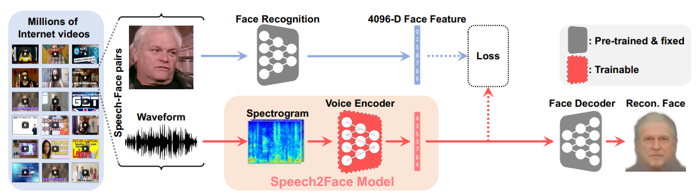

# Speech-to-Face
Generate an image of a human face based on that person's speech.
The general aim of this project is to recreate Speech-to-Face pipeline presented in the [Speech2Face: Learning the Face Behind a Voice](https://arxiv.org/abs/1905.09773) paper [1].
Whole implementation is based on PyTorch framework.

## Speech-to-Face pipeline:

## Overview
In this project you will find implementation of three models:
- Voice Encoder - arhitecture based on [Speech2Face: Learning the Face Behind a Voice](https://arxiv.org/abs/1905.09773) paper [1]
We trained this model from scratch

- Face Encoder - architecture based on [Deep Face Recognition](https://www.robots.ox.ac.uk/~vgg/publications/2015/Parkhi15/parkhi15.pdf) paper [2]
In this project we didn't implement and train this model ourselves, we used existing trained models from:
    - VGG-face model from [github.com/serengil/deepface](https://github.com/serengil/deepface) (in our project it is called `VGGFace_serengil`) [4]
    - VGG-face (16) model from [github.com/rcmalli/keras-vggface](https://github.com/rcmalli/keras-vggface) (in our project it is called `VGGFace16_rcmalli`) [5]

  When using Speech-to-Face pipeline or Face-to-Face pipeline you can choose model which will be used

- Face Decoder - architecture based on [Synthesizing Normalized Faces from Facial Identity Features](https://arxiv.org/abs/1701.04851) paper [3]
We trained this model from scratch

## Sections
To read more about the project go to the page that you are interested in:
- [Data preprocessing](https://github.com/Kacper-Pietkun/Speech-to-face/tree/master/src/data_preprocessing)
    - Converting audio files of speech to spectrograms
    - Converting images of faces to 4096-D feature vectors (face embeddings)
    - Generating face landmarks for images of faces
    - Resizing images
    - Normalizing directory names
- [Dataset classes](https://github.com/Kacper-Pietkun/Speech-to-face/tree/master/src/datasets)
    - Dataset structure for VoiceEncoder
    - Dataset structure for FaceDecoder
- [Models](https://github.com/Kacper-Pietkun/Speech-to-face/tree/master/src/models)
    - VoiceEncoder
    - FaceEncoder
    - FaceDecoder
- [Converting FaceEncoder model from TensorFlow to PyTorch](https://github.com/Kacper-Pietkun/Speech-to-face/tree/master/src/tensorflow_to_pytroch)
    - Convert FaceEncoder implementation from TensorFlow to Pytorch (model and trained weights from [github.com/serengil/deepface](https://github.com/serengil/deepface) repository)
    - Convert FaceEncoder implementation from TensorFlow to Pytorch (model and trained weights from [github.com/rcmalli/keras-vggface](https://github.com/rcmalli/keras-vggface) repository)
- [Train VoiceEncoder model and FaceDecoder model](https://github.com/Kacper-Pietkun/Speech-to-face/tree/master/src/train)
    - Scrpit for training VoiceEncoder model
    - Script for training FaceDecoder model
- [Inference - usage of trained models](https://github.com/Kacper-Pietkun/Speech-to-face/tree/master/src/inference)
    - Speech-to-Face pipeline: Use trained models (VoiceEncoder and FaceDecoder) to generate image of a face based on a person's speech
    - Face-to-Face pipeline: Use trained models (FaceEncoder and FaceDecoder) to generate image of a face based on image of a face

## Results
To be published soon

## References

[1] Oh, Tae-Hyun, et al. "Speech2face: Learning the face behind a voice." Proceedings of the IEEE/CVF conference on computer vision and pattern recognition. 2019.
[2] Parkhi, Omkar, Andrea Vedaldi, and Andrew Zisserman. "Deep face recognition." BMVC 2015-Proceedings of the British Machine Vision Conference 2015. British Machine Vision Association, 2015.
[3] Cole, Forrester, et al. "Synthesizing normalized faces from facial identity features." Proceedings of the IEEE conference on computer vision and pattern recognition. 2017.
[4] [github.com/serengil/deepface](https://github.com/serengil/deepface)
[5] [github.com/rcmalli/keras-vggface](https://github.com/rcmalli/keras-vggface)
