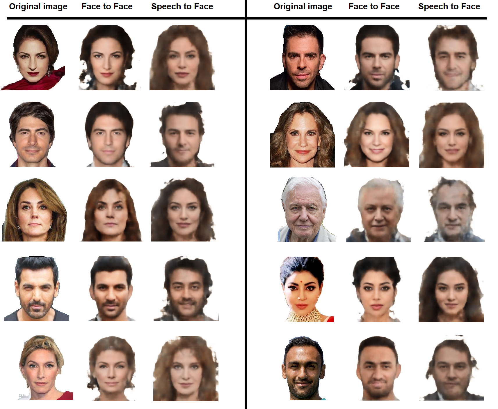

# Speech-to-Face
Generate an image of a human face based on that person's speech

The general aim of this project is to recreate and improve Speech-to-Face pipeline presented in the [Speech2Face: Learning the Face Behind a Voice](https://arxiv.org/abs/1905.09773) paper [1]

Whole implementation is based on PyTorch framework

## Update 10.01.2025
Link to google drive with trained weights of face_decoder and ast models - [drive](https://drive.google.com/drive/u/2/folders/1dwHbmtdppmsrUHks9Gw82zDA15qJm9o8)

Link to recently published paper on this project - [Face From Voice: PyTorch Adaptation of Speech2Face Framework](https://www.sciencedirect.com/science/article/pii/S1877050924024153)

## Overview
In this project you will find implementation of three models:
- **Voice Encoder**
  In this project we used two different models:
    - Architecture based on [Speech2Face: Learning the Face Behind a Voice](https://arxiv.org/abs/1905.09773) paper [1], we call it VE_conv (We trained this model from scratch)
    - Audio Spectrogram Transformer (AST) - we used pre-trained model from [Hugging Face](https://huggingface.co/docs/transformers/model_doc/audio-spectrogram-transformer) and fine-tuned it
  
  When using Speech-to-Face pipeline you can choose model which will be used

- **Face Encoder** - architecture based on [Deep Face Recognition](https://www.robots.ox.ac.uk/~vgg/publications/2015/Parkhi15/parkhi15.pdf) paper [2]

  In this project we didn't implement and train this model ourselves, we used existing trained models from:
    - VGG-face model from [github.com/serengil/deepface](https://github.com/serengil/deepface) (in our project it is called `VGGFace_serengil`) [4]
    - VGG-face (16) model from [github.com/rcmalli/keras-vggface](https://github.com/rcmalli/keras-vggface) (in our project it is called `VGGFace16_rcmalli`) [5]

  When using Speech-to-Face pipeline or Face-to-Face pipeline you can choose model which will be used

- **Face Decoder** - architecture based on [Synthesizing Normalized Faces from Facial Identity Features](https://arxiv.org/abs/1701.04851) paper [3]

  We trained this model from scratch

## Sections
To read more about the project go to the page that you are interested in:
- **[Data preprocessing](https://github.com/Kacper-Pietkun/Speech-to-face/tree/master/src/data_preprocessing)**
    - Converting audio files of speech to spectrograms (separate for VE_conv and AST)
    - Converting images of faces to 4096-D feature vectors (face embeddings)
    - Generating face landmarks for images of faces
    - Resizing images
    - Normalizing directory names
- **[Dataset classes](https://github.com/Kacper-Pietkun/Speech-to-face/tree/master/src/datasets)**
    - Dataset structure for VoiceEncoder (the same for VE_conv and AST)
    - Dataset structure for FaceDecoder
- **[Models](https://github.com/Kacper-Pietkun/Speech-to-face/tree/master/src/models)**
    - VoiceEncoder
    - FaceEncoder
    - FaceDecoder
- **[Converting FaceEncoder model from TensorFlow to PyTorch](https://github.com/Kacper-Pietkun/Speech-to-face/tree/master/src/tensorflow_to_pytroch)**
    - Convert FaceEncoder implementation from TensorFlow to Pytorch (model and trained weights from [github.com/serengil/deepface](https://github.com/serengil/deepface) repository)
    - Convert FaceEncoder implementation from TensorFlow to Pytorch (model and trained weights from [github.com/rcmalli/keras-vggface](https://github.com/rcmalli/keras-vggface) repository)
- **[Train VoiceEncoder model and FaceDecoder model](https://github.com/Kacper-Pietkun/Speech-to-face/tree/master/src/train)**
    - Scrpit for training VoiceEncoder model (separate for VE_conv and AST)
    - Script for training FaceDecoder model
- **[Inference - usage of trained models](https://github.com/Kacper-Pietkun/Speech-to-face/tree/master/src/inference)**
    - Speech-to-Face pipeline: Use trained models (VE_conv/AST and FaceDecoder) to generate image of a face based on a person's speech
    - Face-to-Face pipeline: Use trained models (FaceEncoder and FaceDecoder) to generate image of a face based on image of a face

## Used datasets
In the project we used three different datasets:
1. VoxCeleb1 - for human speech audio [6]
2. VoxCeleb2 - for human speech audio [7]
3. HQ-VoxCeleb - for normalized facial images [8]

`HQ-VoxCeleb` dataset was used to train FaceDecoder model. To train VoiceEncoder model we filtered `VoxCeleb1` and `VoxCeleb2` datasets to get audio files for the identities present in `HQ-VoxCeleb` (because `HQ-VoxCeleb` does not contain normalized face images for every identity present in `VoxCeleb1` or `VoxCeleb2` datasets)

## Results (cherry-picked)
We achieved the best results using fine-tuned AST as VoiceEncoder model. Moreover, we used VGGFace_serengil as the FaceEncoder when training the VoiceEncoder and FaceDecoder models. The results obtained when using our trained from scratch VE_conv model were much worse. In the image below you can see the conclusion of our work. In the left column you can see the original image of the person from the HQ-VoxCeleb dataset. In the middle column you can see the recostruction of the face from the Face-to-Face pipeline (i.e. convert image to the face embbedding and reconstruct the image - voice is not used in this pipeline). Finally in the right column you can see the results from the Speech-to-Face pipeline (i.e. convert speech to the spectrogram, calculate face embedding from that spectrogram, reconstruct the face).

## References

[1] Oh, Tae-Hyun, et al. "Speech2face: Learning the face behind a voice." Proceedings of the IEEE/CVF conference on computer vision and pattern recognition. 2019.

[2] Parkhi, Omkar, Andrea Vedaldi, and Andrew Zisserman. "Deep face recognition." BMVC 2015-Proceedings of the British Machine Vision Conference 2015. British Machine Vision Association, 2015.

[3] Cole, Forrester, et al. "Synthesizing normalized faces from facial identity features." Proceedings of the IEEE conference on computer vision and pattern recognition. 2017.

[4] [github.com/serengil/deepface](https://github.com/serengil/deepface)

[5] [github.com/rcmalli/keras-vggface](https://github.com/rcmalli/keras-vggface)

[6] [robots.ox.ac.uk/~vgg/data/voxceleb/vox1.html](https://www.robots.ox.ac.uk/~vgg/data/voxceleb/vox1.html)

[7] [robots.ox.ac.uk/~vgg/data/voxceleb/vox2.html](https://www.robots.ox.ac.uk/~vgg/data/voxceleb/vox2.html)

[8] Bai, Yeqi, et al. "Speech Fusion to Face: Bridging the Gap Between Human's Vocal Characteristics and Facial Imaging." Proceedings of the 30th ACM International Conference on Multimedia. 2022.
